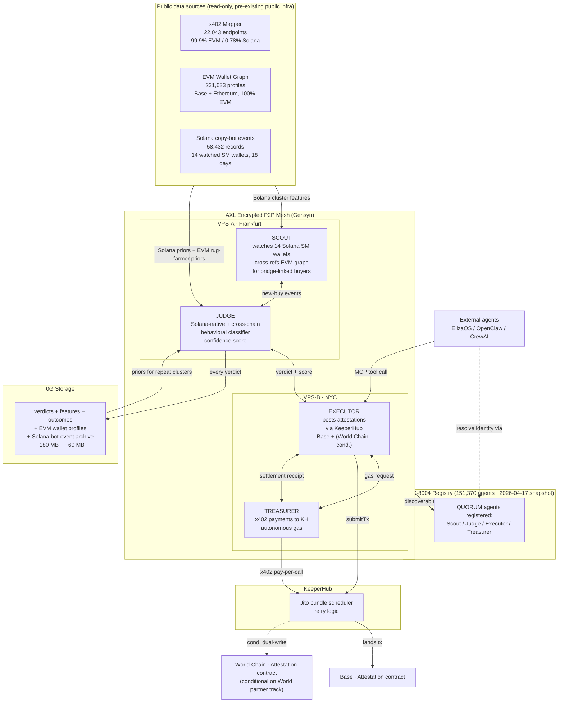

# QUORUM

*Four AI agents. One encrypted mesh. Verdicts on memecoin rugs before the pump ends.*

**Hackathon**: ETHGlobal OpenAgents (async)
**Build window**: 2026-04-24 → 2026-05-03
**Submission**: 2026-05-03 18:00 CEST
**License**: MIT

---

## TL;DR

Memecoin rugs cost retail buyers over five billion dollars since January. Every detection stack today is one model, staring at one feed. That's not how real forensic teams work.

QUORUM splits rug detection across four specialized agents — **Scout**, **Judge**, **Executor**, **Treasurer** — each on a separate AXL node, each paying the others in x402, each writing to decentralized storage. It's the smallest real multi-agent organization that actually ships a verdict on-chain.

## Architecture



## The problem

Solana memecoins are the fastest-moving market in crypto — and the most rug-prone. Existing detection is either closed-source, single-model, or human-curated Telegram groups. None of that scales to machine-speed trading.

Three numbers from public data:
- **14** smart-money Solana wallets profiled over **18 days** (58,432 events archived in the public copy-bot logs I run)
- **231,633** EVM wallet profiles indexed (Base + Ethereum) — the cross-chain rug-farmer lookup surface
- **22,043** registered x402 endpoints (99.9% EVM / 0.78% Solana per the mapper I run, 2026-04-27 lockfile)

## How QUORUM works

**Scout** watches 14 curated Solana smart-money wallets for new buys (the 18-day, 58K-event archive is the seed dataset). For every buyer Scout sees, it checks — via an EVM bridge-linker (Wormhole / deBridge / Allbridge) — whether the buyer has bridged from an EVM address in the 231K-profile graph. When there's a link, Scout attaches `evm_rug_prior_count` to the event. Pure Solana detection still runs when no bridge link exists.

**Judge** scores each candidate token from a 10-feature vector split into three families:
- 6 **Solana-native** features: buyer-cluster overlap with prior Solana rugs (from the 58K archive), first-buyer latency, dev-wallet concentration, LP lock status, sniper-bot share, holder count at T+5min.
- 2 **cross-chain** features: `linked_evm_rug_prior`, `evm_cluster_id_rugrate` (when bridge-linker fires).
- 2 **token-structural**: age-to-ATH ratio, re-used bytecode pattern.

Target precision **≥70% on Solana-native features alone**. Cross-chain is bonus uplift, not foundation — the demo floor stands without it.

**Executor** posts verdicts to an attestation contract on Base within 6 seconds of detection using KeeperHub's Jito bundle scheduler — naive `sendTransaction` fails during memecoin pump events. If the World partner track is confirmed at the Day-4 gate, the same verdict dual-writes to World Chain via Coinbase's x402 facilitator (live 2026-04-17).

**Treasurer** holds a small x402 float and autonomously pays KeeperHub per-call via x402 payment channel. No pre-funded escrow, no human in the loop. This is the canonical "agents paying KeeperHub in x402" pattern.

Everything archives to **0G storage**. Next time Judge sees a wallet cluster it has seen before, it pulls the prior verdict and outcome, and weights its current classifier output against historical accuracy. Federated-learning-lite, running across separate AXL nodes.

## The unfair edge — honest data coverage breakdown

**Read [DATA-COVERAGE.md](./DATA-COVERAGE.md)** before drawing conclusions from any number in this README.

Short version:
- **Solana forensic depth** = 14 watched wallets × 18 days × 58,432 events (Solana-native only).
- **Cross-chain forensic depth** = 231,633 EVM wallet profiles (Base + Ethereum, 100% EVM — **not Solana**).
- The two datasets meet via an **EVM bridge-linker** that resolves Solana buyers to EVM counterparties when bridge activity exists. Expected hit rate 5–20% of observed Solana buys.

**Start Fresh disclaimer**: the three public data sources above are pre-existing public infrastructure authored before the hackathon window. All QUORUM agent code (this repository) was written **2026-04-24 → 2026-05-03** inside the ETHGlobal OpenAgents build window. No prior QUORUM code, designs, or assets predate 2026-04-24.

## Why now — the time-series moat

QUORUM's data spine predates every major agent-economy launch our partners just shipped. The mapper was indexing x402 endpoints before Base crossed 100M cumulative x402 transactions. The EVM wallet graph was profiling addresses before the month x402 transaction volume hit its $15M ATH. The Solana copy-bot archive was collecting events before Coinbase's x402 facilitator launched on World Chain (2026-04-17). The ERC-8004 snapshot caught 151,370 agents at the moment that registry crossed a psychological threshold.

Any team can ship four agents on a mesh in ten days. No team can ship ten weeks of longitudinal data on the behaviour of rug farmers on two chains in ten days. That data is the difference between "here's a classifier I trained" and "here's a classifier that knows what the last eighteen days of Solana memecoin buyers actually did."

Time is the one input you cannot buy.

## Partner integrations

### KeeperHub

Executor uses KeeperHub's scheduled-retry primitive and Jito bundle landing path to guarantee attestation inclusion. Treasurer autonomously pays KeeperHub's gas bill via x402 payment channel per-call. The MCP server exposes `quorum/submit-verdict` so external agents (ElizaOS, OpenClaw, CrewAI) can relay their own findings through QUORUM's Executor — turning QUORUM from a closed demo into a reusable execution primitive.

Target: 40+ on-chain verdict attestations over 10 days with zero missed executions.

**Feedback bounty commitment**: KeeperHub offers a separate $500 bounty (2 × $250) for specific, actionable integration feedback. QUORUM's Executor + Treasurer run against KeeperHub's MCP client and Jito bundle path continuously for 10 days — every friction point, every spec drift, every docs gap gets logged to `FEEDBACK-KH.md` in this repo and submitted alongside the main entry on Day 10.

### 0G

Four classes of data flow to 0G:
1. EVM wallet-graph profiles (~180 MB, Base + Ethereum).
2. Solana copy-bot event archive (~60 MB, 18 days × 14 wallets).
3. Every verdict with reasoning trace, timestamps, input features.
4. Outcome labels (rugged / survived) — labeled nightly from on-chain price data.

Classes (3) and (4) form a reinforcement loop: Judge weights next verdict by historical precision on similar clusters. 0G compute is a stretch (Day-7 decision gate), not a dependency.

### Gensyn AXL

Four AXL nodes, four distinct roles, two physically separate hosts — VPS Frankfurt and VPS New York. Real cross-geography AXL routing, not same-host process-to-process fakery.

Showcased patterns:
1. Peer discovery via AXL's DHT-style lookup — no central broker.
2. Encrypted ephemeral group formation — Scout broadcasts "possible rug" to available Judge instances.
3. Asynchronous reply collection — Executor awaits quorum across any available Judge instances (hence the project name).

Includes a **reconnect-after-partition test** in [`infra/chaos.sh`](./infra/chaos.sh) (lands Day 7–8): kill one AXL node mid-verdict, the remaining three carry on, the killed node rejoins and re-syncs state from 0G. The bidirectional roundtrip across Frankfurt ↔ NYC is already verified via [`infra/axl-hello.sh`](./infra/axl-hello.sh) (Day-1, signed messages crossing both ways).

### World Chain (execution-layer narrative, not a separate track)

Coinbase's x402 facilitator went live on World Chain on 2026-04-17 — the same week this project ships. QUORUM's Executor optionally dual-writes each verdict to World Chain alongside Base, exercising Coinbase's day-12-post-launch facilitator on a production-shaped workload. This sits inside the KeeperHub integration story as "the execution layer routes to whichever chains have facilitators the same day they come online", not as a separate submission track (OpenAgents does not list World as a partner prize as of 2026-04-18 portal check).

## Run it yourself

See [RUNBOOK.md](./RUNBOOK.md) for the cross-host deploy guide. TL;DR:

```bash
# Frankfurt (VPS-A): Scout + Judge
./infra/deploy-vps.sh frankfurt

# NYC (VPS-B): Executor + Treasurer
./infra/deploy-vps.sh nyc

# Cross-Atlantic AXL roundtrip smoke test (already verified Day 1):
./infra/axl-hello.sh

# Local docker fallback:
docker compose up
```

## Chaos test

```bash
./infra/chaos.sh   # lands Day 7–8 of the build window
```

Kills one agent mid-verdict; remaining three continue; killed agent rejoins and syncs state from 0G. Target recovery <30s.

## Backtest results

_To be populated Day 3 (2026-04-26) in [`judge/backtest/backtest-report.md`](./judge/backtest/backtest-report.md)._

Target: ≥70% precision on Solana-native features alone over the 47-event archived replay set, per-feature-family breakdown, false positive rate.

## Agent identity

All four QUORUM agents register on ERC-8004 (151,370-agent ecosystem per 8004scan snapshot 2026-04-17):

| Agent | Role | 8004scan link |
|-------|------|---------------|
| Scout | Solana watcher + EVM bridge-linker | _populated Day 7_ |
| Judge | Behavioral classifier | _populated Day 7_ |
| Executor | Attestation + KeeperHub client | _populated Day 7_ |
| Treasurer | x402 autonomous payments | _populated Day 7_ |

## Roadmap

- Expand Solana wallet coverage (14 → 50+) via on-chain smart-money discovery.
- Additional chains as x402 facilitators come online (World Chain already live 2026-04-17; more expected Q2–Q3 2026).
- Open MCP tool for third-party consumers (ElizaOS integrations first, CrewAI next).

## Credits

Built by **Tom Smart** ([@TomSmart_ai](https://x.com/TomSmart_ai)) for ETHGlobal OpenAgents 2026.

AI assistance via Claude Code (Anthropic) — used for scaffolding, code review, and documentation. All final design decisions, integration choices, and architectural commitments authored by the human builder. See commit history for AI-assistance attribution on a per-commit basis.

## License

MIT — see [LICENSE](./LICENSE).
