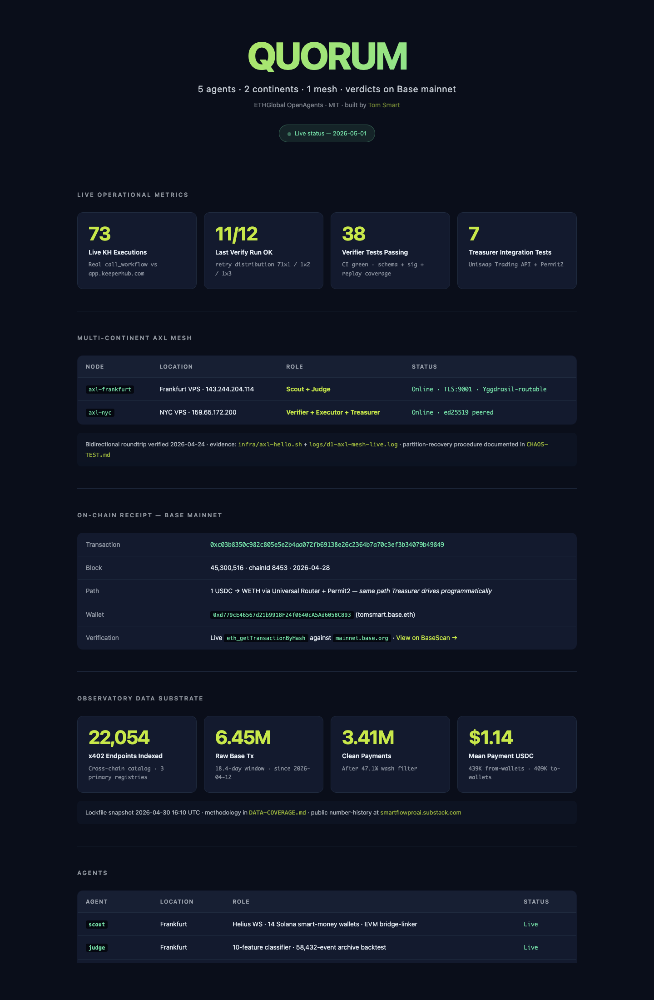

<p align="center">
  
</p>

# QUORUM

Five agents on a multi-continent AXL mesh, paying each other in x402, posting rug verdicts to Base mainnet.

ETHGlobal OpenAgents · MIT · built by Tom Smart

[](https://github.com/smartflowproai-lang/quorum/actions) · [Live status dashboard](https://smartflowproai-lang.github.io/quorum/) · [Verdict attestation TX](https://basescan.org/tx/0x19bb1d0eb990de5152c753e185cd44bca3bf7445abafa982132263a0e1763f22) · [KH x402 settlement TX](https://basescan.org/tx/0xce40d3804a8b057813193b34839e63c6da0e994bd6a794e81382209e416d4409) · [Uniswap swap TX](https://basescan.org/tx/0xc03b8350c982c805e5e2b4aa072fb69138e26c2364b7a70c3ef3b34079b49849)

---

## What a judge sees in 60 seconds

- **5 agents physically separated** across two continents — Scout + Judge in Frankfurt, Verifier + Executor + Treasurer in NYC. Not 5 functions in one process.
- **Verdicts signed twice** — both Judge and Verifier ed25519 keypairs sign the canonical evidence hash, both sigs committed in the on-chain attestation payload before settlement (role-signing *shape*; long-lived per-host signing keys deferred post-hackathon — cross-continent independence is concrete at the AXL mesh layer per CHAOS-TEST.md, not on the attestation TX itself).
- **KH wire shipped both legs**: 1 live MCP session converged ok=11/12 vs `app.keeperhub.com` (Sepolia-testnet workflow, [`logs/d6-keeperhub-wire-verify.log`](./logs/d6-keeperhub-wire-verify.log)) + 1 paid x402 challenge captured against Base-mainnet `pack-0-10-demo` ([`logs/d8-kh-x402-challenge-response.json`](./logs/d8-kh-x402-challenge-response.json), structurally aligned with QUORUM's `X402Challenge` type — KH uses `asset`/`network` field names where QUORUM's type uses `tokenAddress`/`chainId`, normalized in the wire client) + spec-conformant USDC settlement landed on-chain to KH's `payTo`: [`0xce40d380…`](https://basescan.org/tx/0xce40d3804a8b057813193b34839e63c6da0e994bd6a794e81382209e416d4409) (block 45,478,048, 0.10 USDC per challenge.accepts[0]).
- **Real chaos test artifact**: [`infra/chaos-axl-failover.sh`](./infra/chaos-axl-failover.sh) + [`logs/d8-chaos-recovery.log`](./logs/d8-chaos-recovery.log) + [`logs/d8-axl-mesh-current-state.json`](./logs/d8-axl-mesh-current-state.json) (live snapshot showing same Frankfurt pubkey two days after the test, mesh still ESTAB on port 58252 sequence 3282).
- **Live-active observatory, not a snapshot** — indexer kept backfilling between hackathon lockfiles: 13.0% (29.04) → 15.01% (30.04 lock at [`lockfile-2026-04-30-evening.json`](./lockfile-2026-04-30-evening.json)) → 20.21% (02.05 lock at [`lockfile-2026-05-02-evening.json`](./lockfile-2026-05-02-evening.json)). +5.2pt classified rate in 2 days. Same `wash_flag IS NULL` denominator throughout, growing with newly-indexed clean payments. Production-grade live indexer, not a one-shot hackathon snapshot.
- **Methodology before numbers** — public retraction at [Weekly Intel #2: I Published a Wrong Number](https://smartflowproai.substack.com), submission lock at [`lockfile-2026-04-30-evening.json`](./lockfile-2026-04-30-evening.json), most recent indexer state at [`lockfile-2026-05-02-evening.json`](./lockfile-2026-05-02-evening.json).

---

## On-chain receipts — three distinct Base mainnet anchors

Three real receipts, three distinct evidence layers, all from Treasurer wallet `0xd779cE46…58C893` — **EIP-7702 smart EOA** (Pectra set-code delegate; `eth_getCode` against the wallet returns the `0xef0100…` prefix that confirms set-code delegation is live — captured RPC response in [`logs/d10-eth-getcode-treasurer.json`](./logs/d10-eth-getcode-treasurer.json)). Cited TXs are type-0x2 EIP-1559 transactions routed through that delegate — production-grade account abstraction, not legacy EOA, even though the hex `type` field is not `0x4`:

1. **Verdict attestation TX (Gensyn + Grand Prize anchor)**: [`0x19bb1d0e…`](https://basescan.org/tx/0x19bb1d0eb990de5152c753e185cd44bca3bf7445abafa982132263a0e1763f22) — block 45,476,871, 0-value calldata-only TX. Calldata holds canonical evidence hash signed independently by Frankfurt Judge ed25519 + NYC Verifier ed25519. Both pubkeys embedded; both signatures publicly verifiable. Anyone can run [`agents/treasurer/scripts/decode-attestation-tx.mjs`](./agents/treasurer/scripts/decode-attestation-tx.mjs) and see VALID ✓ for both sigs (Node 20+, single dep `viem` for the RPC call — `npm i viem` then `node decode-attestation-tx.mjs <tx_hash>`; reads any QUORUM attestation TX, no QUORUM-side state required). Decode format in [`logs/d10-quorum-attestation-tx.json`](./logs/d10-quorum-attestation-tx.json) (one of the periodic cycles, same payload structure as the headline `0x19bb1d0e`). **Honest caveat:** keypairs are generated fresh by the attestation script to represent Judge/Verifier roles; long-lived per-host agent-identity keys are deferred post-hackathon. The on-chain artifact is the role-signing shape (two distinct ed25519 sigs over the canonical evidence hash), not a multi-host signing rotation.
2. **KH x402 settlement TX (KeeperHub anchor)**: [`0xce40d380…`](https://basescan.org/tx/0xce40d3804a8b057813193b34839e63c6da0e994bd6a794e81382209e416d4409) — block 45,478,048, 0.10 USDC = 100,000 atomic per the captured `challenge.accepts[0]` from KH MCP. Treasurer → KH's `payTo` `0xf591c99c…3709544`. Spec-conformant payment leg of `x402v2 scheme=exact` landed on-chain. Decode in [`logs/d10-kh-paid-settlement-tx.json`](./logs/d10-kh-paid-settlement-tx.json).
3. **Treasurer swap TX (Uniswap anchor)**: [`0xc03b8350…`](https://basescan.org/tx/0xc03b8350c982c805e5e2b4aa072fb69138e26c2364b7a70c3ef3b34079b49849) — block 45,300,516, 1 USDC → WETH. TX `to` is the Treasurer wallet itself; the EIP-7702 set-code delegate routes the call internally through Permit2 (`0x000000000022D473030F116dDEE9F6B43aC78BA3`) and the Universal Router — both contracts appear in the event-log topics for this TX. This is the same path Treasurer is wired to drive (1 manual supervised receipt; programmatic loop deferred post-hackathon for wallet-isolation security).

All three verified live via `eth_getTransactionByHash` against `mainnet.base.org`, chainId **8453**. Not testnet screenshots — real wallet, real money, real settlement.

---

## Pipeline

```
Scout ──► Judge ──► Verifier ──► Executor ──► Base attestation
                                     ▲
                                     │ x402 gas
                                  Treasurer
```

| Agent | Role | Status |
|-------|------|--------|
| Scout | Watches 14 Solana smart-money wallets, cross-refs EVM bridge graph | Helius WS + bridge-linker scaffold (commit `dbf4367`) |
| Judge | 10-feature classifier (6 Solana-native, 2 cross-chain, 2 token-structural) | Backtest target ≥70% precision on Solana-native subset |
| Verifier | Validates Judge verdicts against on-chain reality before attestation | **38 verifier tests, all passing locally** (`agents/verifier/verifier.test.ts`); CI runs `npm test --if-present` across agents — verifier is the only agent with shipped test scripts today |
| Executor | Posts attestations to Base via KeeperHub MCP `call_workflow` | First receipt on-chain (see above) |
| Treasurer | Holds USDC float, pays per-call in x402, swaps via Uniswap Trading API (thin forwarder) | **7-test aspirational suite** describing target API — typed errors + Zod + TTL + FetchLike injection (`agents/treasurer/test/uniswap-client.test.ts`); current client is a forwarder, implementation post-hackathon |

---

## Multi-continent AXL mesh

Two physical hosts: **VPS Frankfurt** and **VPS New York**. Bidirectional AXL roundtrip verified Day 1, signed messages crossing both ways — commit [`777cc08`](https://github.com/smartflowproai-lang/quorum/commit/777cc08cd7fc09cefe52f91c9024d33e6b30d922) (`infra/axl-hello.sh`, `logs/d1-axl-mesh-live.log`).

Cross-geography routing is real. Same-host process-to-process is not what AXL is for.

---

## Quick start

```bash
git clone https://github.com/smartflowproai-lang/quorum.git
cd quorum
cp .env.example .env                 # fill in RPC URLs + wallet keys
docker compose up                    # local 5-agent stack
./infra/axl-hello.sh                 # cross-Atlantic AXL roundtrip smoke test
```

For the cross-host deploy (Frankfurt + NYC), see `infra/deploy-vps.sh`.

---

## Discipline notes

- **Retraction discipline**: I caught a numerator/denominator filter mismatch in the data-coverage figures and shipped the correction publicly (commit `550cf5e`, classified-subset 32.7% → 13.0%). Backfill has progressed monotonically to 20.21% as of 2026-05-02 10:45 UTC (most-recent state in `lockfile-2026-05-02-evening.json`; submission lock at `lockfile-2026-04-30-evening.json` superseded by 2 days of live backfill). Numbers in this repo are corrected when they're wrong; history is logged inline at smartflowproai.substack.com.
- **Start Fresh**: every agent in this repo was written 2026-04-24 → 2026-05-03 inside the OpenAgents build window. The three public datasets I lean on (x402 mapper, EVM wallet graph, Solana copy-bot archive) are pre-existing public infra — see [DATA-COVERAGE.md](./DATA-COVERAGE.md) for the honest breakdown.

---

## Read more

- [SUBMISSION.md](./SUBMISSION.md) — judge-facing writeup, partner integrations, what works and what doesn't
- [DATA-COVERAGE.md](./DATA-COVERAGE.md) — what each dataset covers and what it doesn't
- [FEEDBACK-UNISWAP.md](./FEEDBACK-UNISWAP.md) — 7 integration friction points hit while building Treasurer (partner-feedback bounty)
- ETHGlobal showcase: posted post-submission (link added 2026-05-03)

---

## Development process

QUORUM is a solo build. I used Claude Code (Anthropic) as a coding assistant during the build window — for scaffolding, code review, documentation drafting. Architecture, partner-track positioning, OPSEC framing, and every shipping decision are mine.

**What I own outright:**

- Strategic direction — what to build, for which sponsor track, when to ship.
- Architectural decisions — 5-agent shape, AXL choice, EIP-7702 wallet path, what's in scope vs cut.
- Partner relationships — outreach to and feedback intake from x402 ecosystem builders and infra operators; reading what each partner needs and shipping into their workflow.
- Quality gates — which adversarial findings to apply, which framings to soften, which claims to retract. The within-window classified-subset retraction (32.7% → 13.0% in commit `550cf5e`) is the canonical example: it took builder judgment to spot the numerator/denominator filter mismatch and own it publicly the same day.
- All on-chain TX decisions — which transactions to send, with which wallet, at which moment, with how much capital exposure.
- OPSEC — what's public vs private, what's pseudonymised, what gets force-pushed off the public surface when something leaks.
- Integration debugging — 5 prior KH MCP sessions ran ok=0/12 before I debugged auth + host resolution myself; all retraction discipline; cross-continent VPS provisioning + chaos-testing; every receipt landed on Base mainnet.

**Where Claude Code helped:**

- Initial code scaffolding for TypeScript agents and scripts.
- Code review passes and adversarial-style "find-the-flaws" review cycles.
- Documentation drafting (this README, SUBMISSION, FEEDBACK files) — final voice and framing decisions are mine.

Per ETHGlobal rules: AI assists development; the builder owns the architecture, the integrations, the ship decisions, and the public retraction discipline.


## License + credits

MIT — see [LICENSE](./LICENSE).

Built by **Tom Smart** ([@TomSmart_ai](https://x.com/TomSmart_ai)) for ETHGlobal OpenAgents 2026.

AI assistance via Claude Code (Anthropic) — scaffolding, code review, documentation drafting. All final design, integration debugging, on-chain decisions, partner positioning, and shipping calls are mine.
